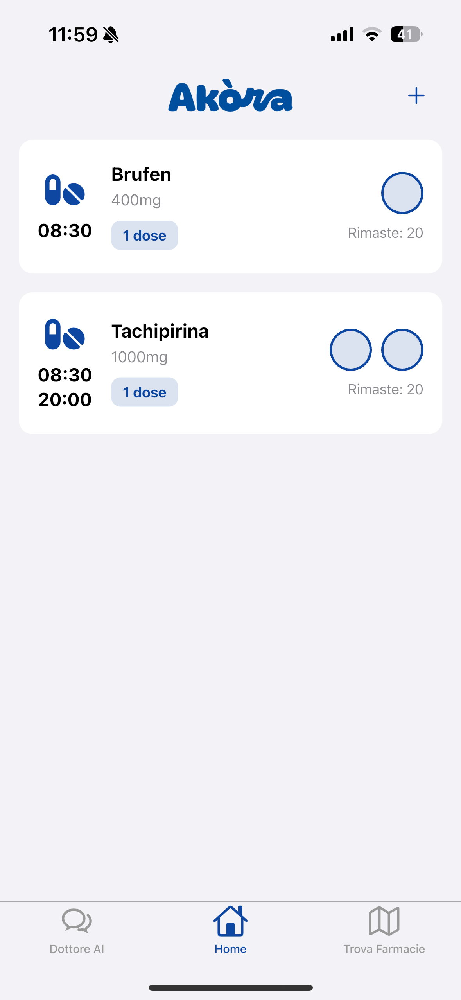
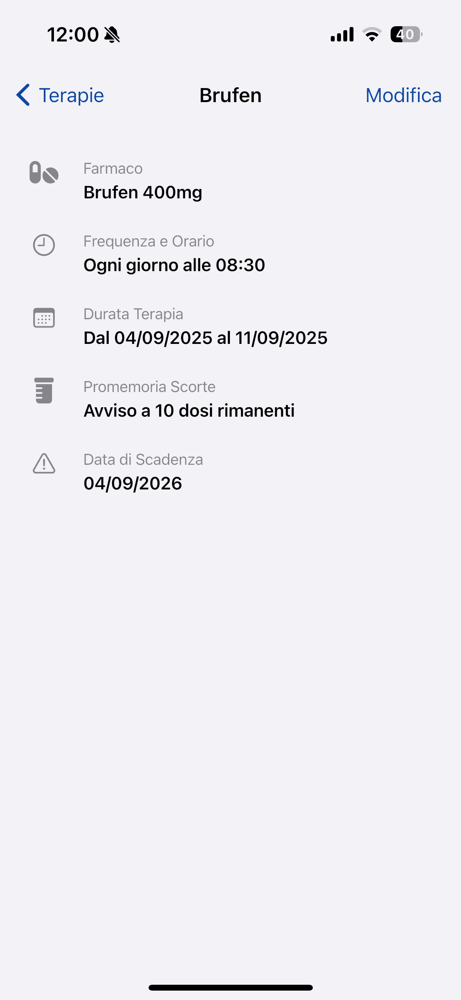
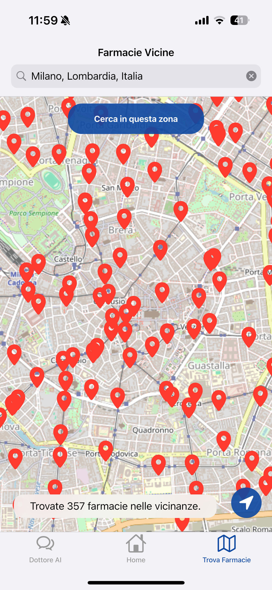

# Akòra

Your Daily Therapeutic Support 🏥💊

<div align="center">
  
  
  [](https://flutter.dev)
  [](https://dart.dev)
  [](https://flutter.dev)
  [](test/)
  [](coverage/)
</div>

## 📱 About

Akòra is a modern, cross-platform mobile application built with Flutter, designed to provide users with reliable daily support for their medication schedules. The app allows users to easily add, manage, and track their therapies, with a robust local notification system to ensure they never miss a dose.

This project was developed as a comprehensive mobile application portfolio piece, showcasing a clean Cupertino-based UI, local database management with Drift, and integration with external services for maps and AI-driven assistance.

### 🎯 Key Highlights
- **Privacy-First**: All health data stored locally on device
- **AI-Powered**: Integrated OpenAI assistant for medical guidance
- **Location-Aware**: Smart pharmacy finder with real-time maps
- **Cross-Platform**: Native iOS and Android experience
- **Offline-Ready**: Full functionality without internet connection

---

## ✨ Features

### 🏠 Therapy Management
- **Intuitive Therapy Management:** Easily add, edit, and delete complex medication schedules
- **Multi-Dose & Frequency Support:** Configure therapies for `once daily`, `twice daily`, or `once weekly` schedules with specific times
- **Interactive Home Dashboard:** View all your active therapies, mark doses as taken with a single tap, and track your remaining supply
- **Adaptive UI:** A responsive layout that provides a native-like experience on both iPhone and iPad, featuring a master-detail view for larger screens

### 🔔 Smart Notifications
- **Daily reminders** for each dose with precise timing
- **Low-stock alerts** when medication is running low
- **Expiry date warnings** for time-sensitive drugs
- **Customizable notification** settings for different therapy types

### 🤖 AI Doctor Assistant
- **Intelligent Chat Interface:** A helpful chatbot powered by the OpenAI API
- **Medical Guidance:** Answer general health and medication questions in a safe, informative way
- **Context-Aware Responses:** Understands your therapy context for personalized advice
- **Privacy-Focused:** Conversations processed securely without storing personal data

### 🗺️ Pharmacy Finder
- **Interactive Maps:** Integrated OpenStreetMap view with real-time location
- **Smart Location Detection:** Automatically finds nearby pharmacies based on your location
- **Navigation Integration:** Direct links to native map apps for turn-by-turn directions
- **Detailed Information:** Pharmacy contact details, hours, and services

### 🔒 Privacy & Security
- **Local-First & Private:** All sensitive health data is stored securely on the user's device using a Drift/SQLite database
- **Offline Functionality:** Full app functionality without internet connection
- **No Data Sharing:** Your health information never leaves your device
- **Encrypted Storage:** Secure local data persistence

---

## 🛠️ Technology Stack

### Frontend Framework
- **[Flutter](https://flutter.dev/)** - Cross-platform UI toolkit with Cupertino Design System
- **[Dart](https://dart.dev/)** - Programming language optimized for UI development

### State Management & Navigation
- **[flutter_bloc](https://pub.dev/packages/flutter_bloc)** - Predictable state management pattern
- **[go_router](https://pub.dev/packages/go_router)** - Declarative, stateful routing solution

### Database & Storage
- **[Drift (Moor)](https://drift.simonbinder.eu/)** - Type-safe, reactive database layer on top of SQLite
- **[path_provider](https://pub.dev/packages/path_provider)** - File system path access
- **Local SQLite** - On-device data persistence ensuring privacy

### Notifications & Scheduling
- **[flutter_local_notifications](https://pub.dev/packages/flutter_local_notifications)** - Cross-platform notification scheduling
- **[timezone](https://pub.dev/packages/timezone)** - Timezone-aware scheduling

### Maps & Location Services
- **[flutter_map](https://pub.dev/packages/flutter_map)** - Interactive maps with OpenStreetMap tiles
- **[geolocator](https://pub.dev/packages/geolocator)** - GPS location services and geocoding
- **[map_launcher](https://pub.dev/packages/map_launcher)** - Integration with native map applications

### AI & Chat Integration
- **[dash_chat_2](https://pub.dev/packages/dash_chat_2)** - Modern chat UI components
- **[dart_openai](https://pub.dev/packages/dart_openai)** - OpenAI API integration for AI assistant
- **[google_generative_ai](https://pub.dev/packages/google_generative_ai)** - Google Gemini AI integration for enhanced AI capabilities

### UI & UX
- **[font_awesome_flutter](https://pub.dev/packages/font_awesome_flutter)** - Comprehensive icon library
- **[flutter_slidable](https://pub.dev/packages/flutter_slidable)** - Swipe actions for list items
- **[cupertino_icons](https://pub.dev/packages/cupertino_icons)** - iOS-style icons

### Development & Testing
- **[build_runner](https://pub.dev/packages/build_runner)** - Code generation tool
- **[mockito](https://pub.dev/packages/mockito)** - Mock objects for testing
- **[flutter_test](https://flutter.dev/docs/testing)** - Comprehensive testing framework

---

## 🚀 Getting Started

### Prerequisites

Before you begin, ensure you have the following installed:

- **[Flutter SDK](https://flutter.dev/docs/get-started/install)** (3.8.0 or higher)
- **[Dart SDK](https://dart.dev/get-dart)** (included with Flutter)
- **Code Editor:** VS Code, Android Studio, or IntelliJ IDEA
- **Platform-specific tools:**
  - **Android:** Android Studio with Android SDK
  - **iOS:** Xcode (macOS only)

### Installation

1. **Clone the repository:**
   ```bash
   git clone https://github.com/fgangi/AkoraApp.git
   cd AkoraApp
   ```

2. **Install dependencies:**
   ```bash
   flutter pub get
   ```

3. **Generate database files:**
   ```bash
   flutter pub run build_runner build --delete-conflicting-outputs
   ```

4. **Configure environment variables:**
   
   Create a `.env` file in the root directory:
   ```bash
   cp .env.example .env
   ```
   
   Add your Gemini API key:
   ```env
   GEMINI_API_KEY=your-gemini-api-key-here
   ```
   
   > **Note:** Get your Gemini API key from [Google AI Studio](https://aistudio.google.com/)
   
   > **Note:** The `.env` file is git-ignored for security. Each developer needs their own API key.

5. **Verify installation:**
   ```bash
   flutter doctor
   ```

6. **Run the application:**
   ```bash
   # Run on connected device/emulator
   flutter run
   
   # Run on specific platform
   flutter run -d ios
   flutter run -d android
   ```

### Build for Production

**Android APK:**
```bash
flutter build apk --release
```

**Android App Bundle:**
```bash
flutter build appbundle --release
```

**iOS:**
```bash
flutter build ios --release
```

---

## 🖼️ Screenshots

<div align="center">

| Home Screen | Therapy Details | Pharmacy Map |
| :---: | :---: | :---: |
|  |  |  |
| *Manage your daily medications* | *Detailed therapy information* | *Find nearby pharmacies* |

</div>

## 🏗️ Project Architecture

The project follows a clean, modular architecture pattern:

```
lib/
├── main.dart                 # Application entry point
├── app.dart                  # Main app configuration  
├── core/                     # Core functionality
│   ├── navigation/          # Routing and navigation
│   ├── services/           # Shared services (AI, notifications)
│   └── utils/              # Utility functions and helpers
├── data/                   # Data layer
│   ├── models/            # Data transfer objects
│   └── sources/           # Data sources (local database)
├── features/              # Feature-based modules
│   ├── chat/             # AI doctor chat functionality
│   ├── home/             # Main dashboard and therapy overview
│   ├── maps/             # Pharmacy locator and mapping
│   ├── scaffold/         # App shell and navigation structure
│   └── therapy_management/ # Medication CRUD operations
└── presentation/          # UI theme and styling
```

### Key Design Patterns
- **Feature-First Architecture**: Organized by business features rather than technical layers
- **Service Layer Pattern**: Centralized business logic in dedicated services
- **Repository Pattern**: Abstracted data access through clean interfaces
- **State Management**: Reactive programming with Flutter Bloc

## 🧪 Testing

The project includes comprehensive test coverage across multiple layers:

```bash
# Run all tests
flutter test

# Run tests with coverage report
flutter test --coverage

# Generate HTML coverage report
genhtml coverage/lcov.info -o coverage/html
open coverage/html/index.html
```

### Test Strategy
- **Unit Tests**: Core business logic, services, and utilities
- **Widget Tests**: UI components and user interactions  
- **Integration Tests**: End-to-end feature workflows
- **Mock Testing**: External API and service dependencies

### Test Coverage
- **✅ 402 Total Tests** - All passing with comprehensive coverage
- **📊 90.5% Line Coverage** - Excellent test coverage across the codebase
- **🧪 Test Categories**:
  - AI API Service & Chat Integration
  - Notification Service & Scheduling  
  - Maps Service & Location Features
  - Database Operations & Data Models
  - UI Components & User Interactions
  - Screen Navigation & Routing
  - Edge Cases & Error Handling

## 🔧 Development

### Code Generation
This project uses code generation for database schemas and API models:

```bash
# Watch for changes and regenerate
flutter packages pub run build_runner watch

# One-time generation
flutter packages pub run build_runner build --delete-conflicting-outputs
```

### Development Tools
- **Flutter Inspector**: Widget tree debugging
- **Dart DevTools**: Performance profiling and debugging
- **Database Inspector**: SQLite database browsing
- **Network Inspector**: API call monitoring

## 🌐 Localization

Currently supports:
- 🇮🇹 **Italian (it_IT)** - Primary language
- 🌍 **Extensible**: Ready for additional language packs

## 🔒 Privacy Policy

- **Local Storage**: All health data remains on your device
- **API Usage**: Only non-personal data sent to OpenAI for chat responses
- **Location**: Used only for pharmacy search, not stored or shared
- **No Analytics**: We don't track user behavior or collect usage data

## 🙏 Acknowledgments

- **OpenAI** for providing the AI assistant capabilities
- **Flutter Team** for the excellent cross-platform framework
- **OpenStreetMap** for the mapping data and tiles
- **Open Source Community** for the amazing packages used in this project

---

## 👥 Team

<div align="center">

| [Francesco Gangi](https://github.com/fgangi) | [Simone Grandi](https://github.com/BigSim0) | [Alessandro Salvatore](https://github.com/alesalv0) |
|:---:|:---:|:---:|
| **Lead Developer & Architect** | **Testing Lead & QA Engineer** | **Technical Writer & Designer** |

</div>

---

<div align="center">
  <strong>Made with ❤️ and Flutter</strong>
  <br/>
  <em>Empowering better health management through technology</em>
</div>
